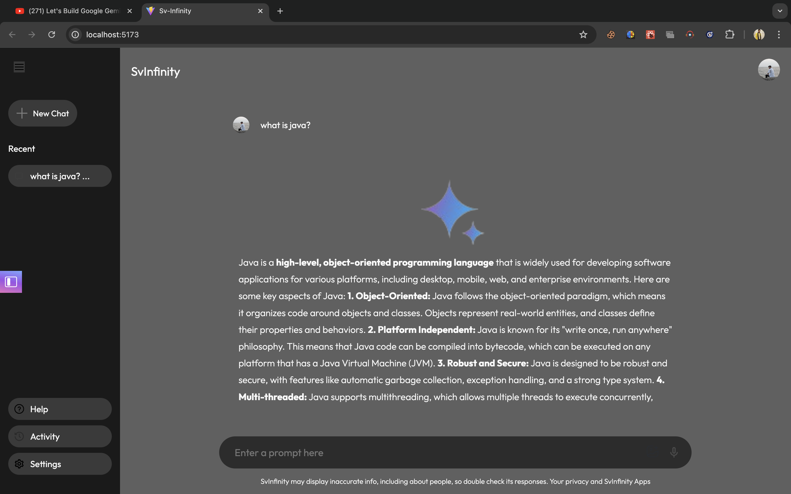

# SvInfinity

SvInfinity is a sophisticated AI-powered assistant that helps users interact with the Gemini API to receive responses to various prompts. This web application features a modern, responsive interface with real-time data processing and several other functionalities aimed at enhancing the user experience.

## Features

### 1. Dark Mode
- Seamless transition between light and dark modes, allowing users to choose the appearance that best suits their environment and preferences.

### 2. Voice Recognition
- Converts voice input into text using the browser's built-in speech recognition capabilities. This feature enables hands-free interaction with the assistant.

### 3. File Upload
- Users can upload files directly through the interface. The uploaded file's name is displayed in the input field, ready to be processed.

### 4. Interactive Prompt Input
- The prompt input field is intuitive and user-friendly. Users can type their queries or commands, press "Enter" to send, or click the send button.

### 5. Gemini API Integration
- SvInfinity is powered by the Gemini API, ensuring accurate and efficient responses to user prompts.

### 6. Chat History
- The application maintains a history of all chats, allowing users to review previous conversations and track the progress of their interactions.

### 7. Real-Time Data Activity
- SvInfinity tracks and displays real-time data activity to ensure users are always informed about the latest updates.

### 8. Help Section
- A dedicated help section provides users with guidance and support, ensuring a smooth experience.

## Screenshots
- 
- 
- 
- 
- 
- 
- 

## Video Demonstration
- [Watch the demo video](public/screenshots/SvInfinity.mov)
